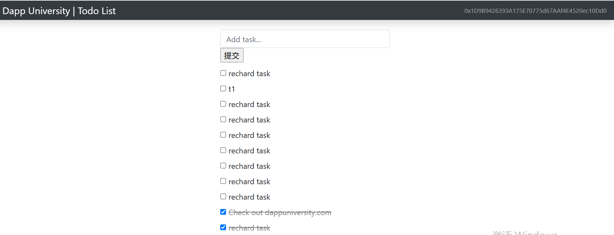

# structure
-  lite-server（a sever base on BrowserSync）,bs-config.json is its config file

- truffle

- -是一个以太坊开发框架。
- -主要用于**编写、编译、部署和测试智能合约**。
- -提供命令行工具（如 `truffle compile`、`truffle migrate`、`truffle test`）。
- -管理合约的部署脚本和测试脚本。

- ganache

- - 是一个**本地以太坊区块链模拟器**。
- - 用于本地开发和测试，模拟真实以太坊网络的行为。
- - 启动后会生成一组测试账户和私钥，方便开发者进行合约部署和交互。
- - 有命令行版（ganache-cli）和桌面版（Ganache GUI）。

# how to run
> 本地运行和ganache交互

```
npm install
```

```
# 安装 Ganache CLI（命令行版)
npm install -g ganache-cli
# 安装完成后，启动本地以太坊节点
ganache-cli --port 7545
```
另起来一个terminal窗口
```
# build contracts
npx truffle compile
# deploy contract to Ganache
npx truffle migrate --network development
```

启动lite-server
```
npm run dev
```

